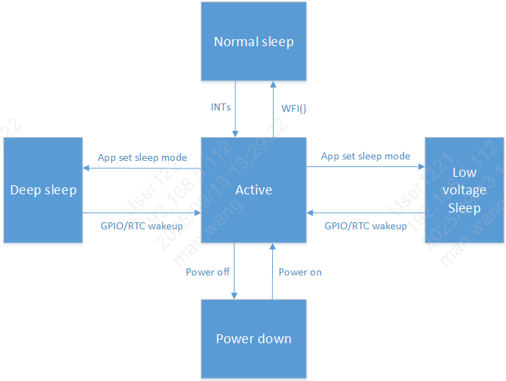

System state machine description
=============================================

:link_to_translation:`zh_CN:[中文]`

The system supports different sleep modes:
 - active
 - cpu wfi
 - low voltage
 - deep sleep
 - shut down

active (normal operation)
--------------------------------------------
 - CPU is in active state, and WIFI/BLE can transmit and receive data normally.

cpu wfi (cpu wfi)
--------------------------------------------
 - When RTOS has no task to process, the system enters the IDLE task. In IDLE, CPU enters WFI sleep.
   Any interrupt can wake up the system from WFI and return to active state.

low voltage sleep (low voltage sleep)
--------------------------------------------
 - Low voltage sleep is a relatively power-saving mode. In this mode, only 32K clock is available.
   Only AON and part of analog modules keep working. Other hardware modules are suspended or powered down under low voltage.

 - In low voltage sleep mode, VDDDIG voltage is reduced.
   If SRAM is not powered down, data stored in SRAM is retained and can still be used after wakeup.

 - Conditions to enter low voltage:
   - 1. RTOS has no task to process, and the system enters IDLE task.
   - 2. Low voltage voting conditions are satisfied (BLE and WIFI enter sleep, APP vote is set, and all required low-voltage votes are set).

 - After wakeup signal is triggered, the system exits low voltage state, and VDDDIG voltage returns to normal level.

 - In low voltage state, wakeup sources (GPIO, RTC, WIFI, BLE) can wake up the system.
   Note: WIFI/BLE low voltage entry is based on internal voting according to their own business scenarios (handled by SDK, no need for application attention).
   Applications should close upper-layer services before entering low voltage.

 - In this mode, 32K clock source can be selected according to scenario.
   Refer to :doc:`bk_clock`.

 - To achieve optimal power consumption, disable unnecessary modules before entering low voltage.
   Re-enable them after exiting low voltage.

deep sleep (deep sleep)
--------------------------------------------
 - Deep sleep is a sleep mode with complete wakeup capability and lowest power consumption.
   In this mode, only 32K clock is available. Only AON and part of hardware modules keep working.
   Other hardware circuit modules are powered down.

 - After wakeup signal is triggered, the system exits deep sleep state and resets.

 - In deep sleep state, wakeup sources (GPIO, RTC) can wake up the system.

 - Default 32K clock source in this mode is ROSC 32K.

 - Conditions to enter deep sleep:
   - 1. RTOS has no task to process, and the system enters IDLE task.
   - 2. Deep sleep voting conditions are satisfied (BLE and WIFI enter sleep, APP vote is set).

shut down (shut down)
--------------------------------------------
 - Entire system is powered off.

State machine switching description
=============================================

Low voltage sleep description
--------------------------------------------

 - Low voltage sleep and deep sleep are system-level (whole-chip) sleep modes.
   If the system enters low voltage/deep sleep while some modules are still running, abnormal module behavior may cause those modules to fail after wakeup.
   To avoid this issue by mechanism, a voting mechanism is used before entering low voltage/deep sleep.

 - Low voltage sleep: currently 64 votes are configured:
   - 1. BLE and WIFI votes are set internally after BLE/WIFI enter sleep. This is handled by SDK and does not need application attention.
   - 2. APP vote is provided for upper-layer application. Set this vote before sleep; after wakeup, if active work is needed for some time, clear this vote; set it again when sleep is needed.
   - 3. Other votes are set by default.
   - 4. For application developers, usually only APP vote needs attention.

 - Conditions to enter low voltage:
   - 1. RTOS has no task to process, and the system enters IDLE task.
   - 2. Low voltage voting conditions are satisfied (BLE and WIFI enter sleep, APP and related votes are set).

   If low voltage entry fails, refer to :doc:`bk_Lowpower_problem_analysis`.

Deep sleep description
-----------------------------------------------

 - Deep sleep: currently 2 votes are configured: BLE and WIFI:
   - 1. System restarts after wakeup from deep sleep.
   - 2. BLE and WIFI votes are set internally after BLE/WIFI enter sleep. This is handled by SDK and does not need application attention.

 - When RTOS has no task to process, the system automatically enters IDLE task and performs WFI.
   If deep sleep conditions are satisfied (deep sleep votes are ready), the system enters deep sleep.

 - Conditions to enter deep sleep:
   - 1. RTOS has no task to process, and the system enters IDLE task.
   - 2. Deep sleep voting conditions are satisfied (BLE and WIFI enter sleep).

   If deep sleep entry fails, refer to :doc:`bk_Lowpower_problem_analysis`.

