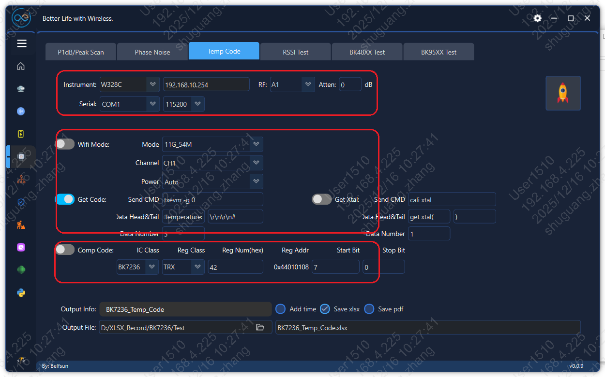
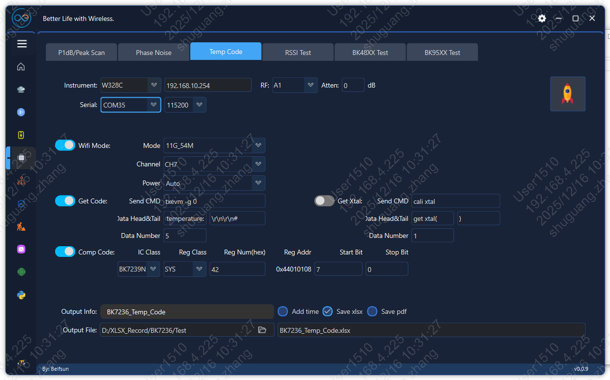
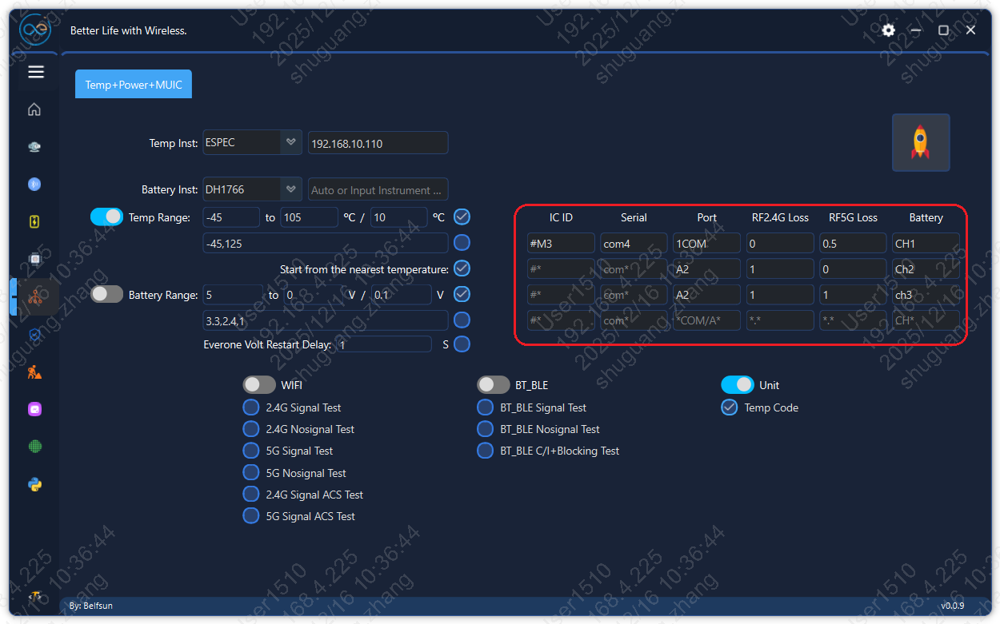
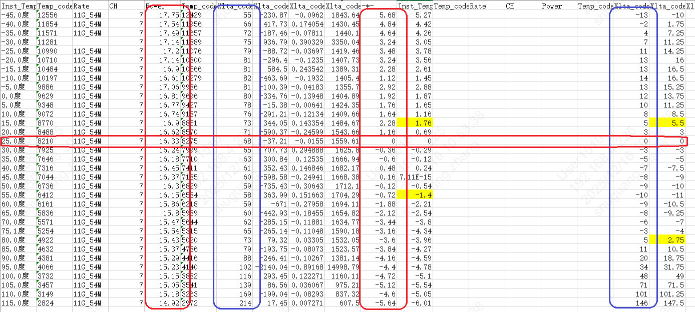
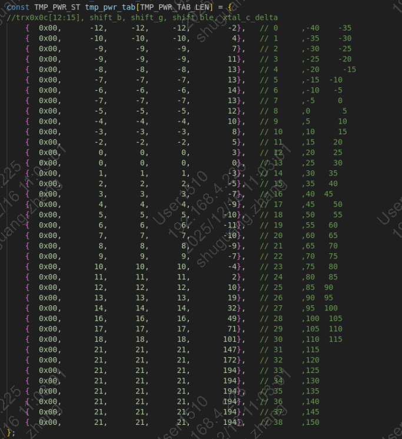

VND_CAL
================

:link_to_translation:`en:[English]`

1、概述
--------------------------
    为了方便客户理解vnd_cal.c里的参数，这里对vnd_cal.c里参数进行说明。

2、代码路径
--------------------------
    路径: ``\middleware\boards\bk7236(bk7236n\bk7239n\bk7258\bk7259)\vnd_cal\vnd_cal.c``

3、功率校准参数
--------------------------

系统会按如下优先级使用功率数据（高 → 低）：

1. **仪器校准功率**：来自仪器校准结果，通常保存在 FLASH 或 OTP（具体介质由产品配置 ``CONFIG_PHY_RECALI_TO_OTP`` 决定）。
2. **FT 校准功率**：来自工厂 FT 写入的功率数据（保存在 OTP）。
3. **默认功率**：来自 ``vnd_cal.c`` 中的默认功率配置（本文件可配置）。

当设备已有仪器校准或 FT 校准数据时，``vnd_cal.c`` 中的“默认功率表”可能不会生效（被更高优先级覆盖）。当缺少校准数据时，默认功率会作为兜底生效。

3.1 仪器校准
~~~~~~~~~~~~~~~~~~~~

3.1.1 校准流程
^^^^^^^^^^^^^^^^^^^^^^^^^^^^^^^^^^^^^^^^^^^^^^^^^^^^^^^^^^^^^^^^^^^^^^^^^^^^^^^^

仪器校准通常用于获得“更贴近实测的功率”，建议流程如下：

.. list-table:: 校准开始
   :header-rows: 1
   :widths: 8 38 54

   * - 步骤
     - 命令
     - 说明(校准开始)
   * - 1
     - ``txevm -e 1``
     - 关闭温度检测
   * - 2
     - ``txevm -g 0``
     - 获取当前温度，校准过程中不要再发送此命令，会影响校准状态
   * - 3
     - ``txevm -x 61``
     - 设置晶体电容补偿

.. list-table:: 校准 2G
   :header-rows: 1
   :widths: 8 38 54

   * - 步骤
     - 命令
     - 说明(校准2G)
   * - 4
     - ``txevm -s 11 1 38``
     - 设置11B制式1信道的功率索引38，信道[1,13]，最多可校准四个信道，必须校准
   * - 5
     - ``txevm -s 54 1 68``
     - 设置11G制式1信道的功率索引68，信道[1,13]，最多可校准四个信道，必须校准
   * - 6
     - ``txevm -s 86 1 55``
     - 设置AX20制式1信道的功率索引55，信道[1,13]，最多可校准四个信道，可不校准
   * - 7
     - ``txevm -s 135 1 58``
     - 设置N40制式1信道的功率索引58，信道[1,13]，最多可校准四个信道，可不校准
   * - 8
     - ``txevm -s 158 1 40``
     - 设置BLE制式1信道的功率索引40，信道[1,40]，最多可校准四个信道，可不校准
   * - 9
     - ``txevm -e 6 11 18.0``
     - 设置11B的目标功率，将会更新到 ``target_pwr_11b``
   * - 10
     - ``txevm -e 6 54 15.0``
     - 设置11G的目标功率，将会更新到 ``target_pwr_11g``

.. list-table:: 校准 5G
   :header-rows: 1
   :widths: 8 38 54

   * - 步骤
     - 命令
     - 说明(校准5G)
   * - 11
     - ``txevm -s 54 5036 61``
     - 设置11A制式36信道（加上5000偏移，下同，见说明）的功率索引61，信道[1,177]，最多可校准八个信道，必须校准
   * - 12
     - ``txevm -s 137 5040 58``
     - 设置AX20_5G制式40信道的功率索引58，信道[1,177]，最多可校准八个信道，可不校准
   * - 13
     - ``txevm -s 128 5064 51``
     - 设置N40_5G制式64信道的功率索引51，信道[1,177]，最多可校准八个信道，可不校准
   * - 14
     - ``txevm -e 6 -band 5 -b 0 54 14.0``
     - 设置11A的目标功率，将会更新到 ``target_pwr_11a``

.. list-table:: 数据保存
   :header-rows: 1
   :widths: 8 38 54

   * - 步骤
     - 命令
     - 说明(数据保存)
   * - 15
     - ``txevm -e 2``
     - 保存校准数据
   * - 16
     - ``txevm -e 4 1``
     - 使能校准数据

**说明：**

- **信道**：5xxx表示5G，同理2xxx表示2G（2G可省略前缀），xxx表示信道
- **设定目标功率（dBm）** 比如：在 ``vnd_cal.c`` 中配置 ``target_pwr_11b`` （见下文），作为各制式/带宽的目标
- **执行仪器校准**：无论是保存到FLASH还是OTP中，校准流程是统一的，但是二者有一点区别——如果将校准结果保存在FLASH，则重新校准的次数仅受FLASH擦写次数限制；如果将校准结果保存在OTP，则最多可以重新校准4次
- **验证**：复测多个信道与多种速率，确认功率与 EVM指标满足要求，建议验证后再执行上述步骤16
- 上述命令参考极致汇仪中的FLOW得到，但是未包含全部指令

3.1.2 未校准信道的功率拟合
^^^^^^^^^^^^^^^^^^^^^^^^^^^^^^^^^^^^^^^^^^^^^^^^^^^^^^^^^^^^^^^^^^^^^^^^^^^^^^^^

仪器校准一般只覆盖少量“关键信道点”。未覆盖的信道会通过内部策略进行**拟合/补点**，说明如下：

- 对于2G，每个制式可以最多校准4个任意信道；对于5G，每个制式可以最多校准8个信道
- 11信道为特定信道，如果``11B/11G``都校准了11信道，则工作时默认使用SRRC功率策略——13信道发射功率会降低以满足SRRC要求
- 在校准功率时，需要将目标功率传入，从而让``bk_wifi_get_tx_power``和``bk_wifi_set_tx_power``正常工作
- 对于未校准信道，会使用其左右的校准信道功率档位进行线性拟合

3.1.3 未校准制式的功率偏移
^^^^^^^^^^^^^^^^^^^^^^^^^^^^^^^^^^^^^^^^^^^^^^^^^^^^^^^^^^^^^^^^^^^^^^^^^^^^^^^^

从3.1.1的校准流程中可以看出，AX20、N40、BLE是可以不用校准的，N20、AC是不校准的，所以这些制式需要从已校准制式偏移出对应的功率表（1LSB代表0.25dB）：

.. list-table:: 未校准制式功率偏移
   :header-rows: 1
   :widths: 14 22 64

   * - 制式
     - 变量
     - 说明
   * - N20
     - ``g_dif_g_n20``
     - N20与11G的档位偏移：``pwr_idx_n20 = pwr_idx_g + g_dif_g_n20``
   * - N40
     - ``g_dif_g_n40``
     - N40与11G的档位偏移：``pwr_idx_n40 = pwr_idx_g + g_dif_g_n40``
   * - AX20
     - ``g_dif_g_ax20``
     - AX20与11G的档位偏移：``pwr_idx_ax20 = pwr_idx_g + g_dif_g_ax20``
   * - BLE
     - ``g_dif_g_ble_ch*``
     - BLE与11G的档位偏移：``pwr_idx_ble = pwr_idx_g - g_dif_g_ble_ch*``
   * - N20_5G
     - ``g_dif_a_n20``
     - N20_5G与11A的档位偏移：``pwr_idx_n20_5g = pwr_idx_a + g_dif_a_n20``
   * - N40_5G
     - ``g_dif_a_n40``
     - N40_5G与11A的档位偏移：``pwr_idx_n40_5g = pwr_idx_a + g_dif_a_n40``
   * - AX20_5G
     - ``g_dif_a_ax20``
     - AX20_5G与11A的档位偏移：``pwr_idx_ax20_5g = pwr_idx_a + g_dif_a_ax20``

3.1.4 未校准速率的功率偏移
^^^^^^^^^^^^^^^^^^^^^^^^^^^^^^^^^^^^^^^^^^^^^^^^^^^^^^^^^^^^^^^^^^^^^^^^^^^^^^^^

即使做了仪器校准，通常也只会选择少量代表性速率作为校准基准；其他速率的功率通过“速率功率偏置表”进行调整（1LSB代表0.25dB）：

.. list-table:: 未校准速率功率偏移
   :header-rows: 1
   :widths: 14 26 60

   * - 制式
     - 变量
     - 说明
   * - 11B
     - ``shift_tab_b``
     - 以11M为基准，依次为：11M、5.5M、2M、1M
   * - 11G
     - ``shift_tab_g``
     - 以54M为基准，依次为：54M、48M、36M、24M、18M、12M、9M、6M
   * - N20
     - ``shift_tab_n20``
     - 以MCS7为基准，依次为：MCS9、MCS8、MCS7、MCS6、MCS5、MCS4、MCS3、MCS2、MCS1、MCS0；（MCS9、MCS8未使用）
   * - N40
     - ``shift_tab_n40``
     - 以MCS7为基准，依次为：MCS9、MCS8、MCS7、MCS6、MCS5、MCS4、MCS3、MCS2、MCS1、MCS0；（MCS9、MCS8未使用）
   * - AX20
     - ``shift_tab_ax20``
     - 以MCS7为基准，依次为：MCS9、MCS8、MCS7、MCS6、MCS5、MCS4、MCS3、MCS2、MCS1、MCS0
   * - 11A
     - ``shift_tab_a``
     - 以54M为基准，依次为：54M、48M、36M、24M、18M、12M、9M、6M
   * - N20_5G
     - ``shift_tab_n20_5g``
     - 以MCS7为基准，依次为：MCS9、MCS8、MCS7、MCS6、MCS5、MCS4、MCS3、MCS2、MCS1、MCS0；（MCS9、MCS8未使用）
   * - N40_5G
     - ``shift_tab_n40_5g``
     - 以MCS7为基准，依次为：MCS9、MCS8、MCS7、MCS6、MCS5、MCS4、MCS3、MCS2、MCS1、MCS0；（MCS9、MCS8未使用）
   * - AX20_5G
     - ``shift_tab_ax20_5g``
     - 以MCS7为基准，依次为：MCS9、MCS8、MCS7、MCS6、MCS5、MCS4、MCS3、MCS2、MCS1、MCS0

建议做法：

- 若某些速率 EVM 更敏感，可对该速率适当“降功率”（提高线性裕量）。
- 若某些速率功率明显偏低，可对该速率适当“加功率”（注意电流/温升/法规裕量）。

3.2 FT校准
~~~~~~~~~~~~~~~~~~~~

FT 校准通常在 OTP 内保存少量信道点位的功率信息，用于量产一致性。

客户可配置项：

- **目标功率（dBm）** 比如：``target_pwr_11b`` （用于统一目标）
- **FT 信道偏置（0.25 dB/LSB）** 比如：``shift_pwr_idx_b_ch1`` （用于信道级微调）

3.2.1 FT校准功率微调
^^^^^^^^^^^^^^^^^^^^^^^^^^^^^^^^^^^^^^^^^^^^^^^^^^^^^^^^^^^^^^^^^^^^^^^^^^^^^^^^

当 FT 校准结果整体偏高/偏低或存在“边信道偏差”时，可按以下表格进行微调：

.. list-table:: FT 校准功率微调
   :header-rows: 1
   :widths: 10 18 34 18 20

   * - 制式
     - 目标功率变量
     - 信道偏置变量
     - 支持信道
     - 微调说明
   * - 11B
     - ``target_pwr_11b``
     - | ``shift_pwr_idx_b_ch1``
       | ``shift_pwr_idx_b_ch7``
       | ``shift_pwr_idx_b_ch13``
     - ch1, ch7, ch13
     - 整体偏差调整目标功率；边信道偏差调整对应信道偏置（1 LSB = 0.25 dB）
   * - 11G
     - ``target_pwr_11g``
     - | ``shift_pwr_idx_g_ch1``
       | ``shift_pwr_idx_g_ch7``
       | ``shift_pwr_idx_g_ch13``
     - ch1, ch7, ch13
     - 整体偏差调整目标功率；边信道偏差调整对应信道偏置（1 LSB = 0.25 dB）
   * - 11A
     - ``target_pwr_11a``
     - | ``shift_pwr_idx_a_ch36``
       | ``shift_pwr_idx_a_ch64``
       | ``shift_pwr_idx_a_ch100``
       | ``shift_pwr_idx_a_ch132``
       | ``shift_pwr_idx_a_ch165``
     - ch36, ch64, ch100, ch132, ch165
     - 整体偏差调整目标功率；边信道偏差调整对应信道偏置（1 LSB = 0.25 dB）

**微调建议：**

- 通过功率验证（不需要功率校准）的方式统计若干模组``11B/G/A``在上述信道的功率
- 通过晶体频偏校准的方式统计电容补偿值并更新到``DEFAULT_TXID_XTAL``
- 根据统计数据，得到``11B/G/A``在上述信道的平均功率，比如： ``actual_pwr_11b``
- 通过公式，比如： ``shift_pwr_idx_b_ch1 = 4 × (target_pwr_11b - actual_pwr_11b)`` 来更新上述变量
- 使用更新后的固件再次验证功率是否满足要求

3.2.2 未校准信道的功率拟合
^^^^^^^^^^^^^^^^^^^^^^^^^^^^^^^^^^^^^^^^^^^^^^^^^^^^^^^^^^^^^^^^^^^^^^^^^^^^^^^^

同3.1.2章节

3.2.3 未校准制式的功率偏移
^^^^^^^^^^^^^^^^^^^^^^^^^^^^^^^^^^^^^^^^^^^^^^^^^^^^^^^^^^^^^^^^^^^^^^^^^^^^^^^^

同3.1.3章节

3.2.4 未校准速率的功率偏移
^^^^^^^^^^^^^^^^^^^^^^^^^^^^^^^^^^^^^^^^^^^^^^^^^^^^^^^^^^^^^^^^^^^^^^^^^^^^^^^^

同3.1.4章节

3.3 默认功率
~~~~~~~~~~~~~~~~~~~~

当设备缺少仪器/FT 校准数据时，系统会使用 ``vnd_cal.c`` 内的默认功率作为兜底。

客户可配置项：

- **目标功率（dBm）** 比如：``target_pwr_11b`` （用于统一目标）
- **默认功率 strip 表** （按信道给 ``power_index`` ）：
  - ``gtxpwr_tab_def_b`` （2.4G 11B）
  - ``gtxpwr_tab_def_g`` （2.4G 11G）
  - ``gtxpwr_tab_def_strip_a`` （5G 11A）
  - ``gtxpwr_tab_def_ble`` （BLE）

注意：

- ``power_index`` 是内部功率表索引（不是 dBm），1 LSB = 0.25 dB。
- 默认表只包含少量信道点位，其他信道会通过内部策略拟合/补点。

3.3.1 默认功率更新
^^^^^^^^^^^^^^^^^^^^^^^^^^^^^^^^^^^^^^^^^^^^^^^^^^^^^^^^^^^^^^^^^^^^^^^^^^^^^^^^

当设备缺少仪器/FT 校准数据时，系统会使用 `vnd_cal.c` 中的默认功率表。客户可以根据实际测试结果更新这些默认值，以提高未校准设备的功率准确性。

**更新建议：**

- 通过功率校准的方式统计若干模组``11B/G/A``在上述信道的功率索引和电容补偿值
- 根据统计数据，将``11B/G/A``在上述信道的平均功率索引，更新到默认功率表中
- 根据统计数据，将电容补偿平均值，更新到``DEFAULT_TXID_XTAL``
- 使用更新后的固件再次验证功率是否满足要求

3.3.2 未校准信道的功率拟合
^^^^^^^^^^^^^^^^^^^^^^^^^^^^^^^^^^^^^^^^^^^^^^^^^^^^^^^^^^^^^^^^^^^^^^^^^^^^^^^^

同3.1.2章节

3.3.3 未校准制式的功率偏移
^^^^^^^^^^^^^^^^^^^^^^^^^^^^^^^^^^^^^^^^^^^^^^^^^^^^^^^^^^^^^^^^^^^^^^^^^^^^^^^^

同3.1.3章节

3.3.4 未校准速率的功率偏移
^^^^^^^^^^^^^^^^^^^^^^^^^^^^^^^^^^^^^^^^^^^^^^^^^^^^^^^^^^^^^^^^^^^^^^^^^^^^^^^^

同3.1.4章节

4、温度补偿参数
--------------------------

温度变化会引起 PA 增益/线性与晶振频偏变化。`vnd_cal.c` 提供了温度点对应的补偿表，用于在不同温度下修正功率与晶振相关参数。

4.1 补偿表
~~~~~~~~~~~~~~~~~~~~

``vnd_cal.c`` 中的温度补偿表 ``tmp_pwr_tab``，以常温（25度）时的功率和晶体频偏为基准，即前一章节中的校准值（对于晶体电容，如果没有校准，会使用默认值 ``DEFAULT_TXID_XTAL`` ）。

- ``tmp_pwr_tab`` 表共有39项，覆盖温度范围从-40度到150度
- 每一项中包含四类功率补偿值（1LSB代表0.25dB）：
  - ``shift_a`` 表示 ``5G OFDM（11A/11AC/11N_5G/11AX_5G）`` 的功率补偿值
  - ``shift_b`` 表示 ``2G DSSS（11B）`` 的功率补偿值
  - ``shift_g`` 表示 ``2G OFDM（11G/11N_2G/11AX_2G）`` 的功率补偿值
  - ``shift_ble`` 表示 ``BLE`` 的功率补偿值
- ``xtal_c_delta`` 表示晶体电容的补偿值

4.2 补偿表更新
~~~~~~~~~~~~~~~~~~~~

推荐更新流程：

- 通过功率校准的方式，在常温（25度）下将若干模组校准到目标功率
- 将模组放入温箱，通过功率验证的方式（建议通过 ``txevm -e 1`` 关闭温度补偿），从-40~120度统计发射功率和电容补偿数据
- 根据统计数据更新温度补偿表 ``tmp_pwr_tab``
- 更新固件后重新验证功率和晶体频偏

4.2.1 打开AE_Super_Tools.exe
^^^^^^^^^^^^^^^^^^^^^^^^^^^^^^^^^^^^^^^^^^^^^^^^^^^^^^^^^^^^^^^^^^^^^^^^^^^^^^^^

4.2.2 选择Unit Test->Temp Code
^^^^^^^^^^^^^^^^^^^^^^^^^^^^^^^^^^^^^^^^^^^^^^^^^^^^^^^^^^^^^^^^^^^^^^^^^^^^^^^^

第一个框：选择仪器和串口

第二个框：设置测试项

第三个框：设置测试结果、文件名及文件地址

火箭按钮是测试启动按键

4.2.3 测试设置：
^^^^^^^^^^^^^^^^^^^^^^^^^^^^^^^^^^^^^^^^^^^^^^^^^^^^^^^^^^^^^^^^^^^^^^^^^^^^^^^^

Wifi Mode：选择用哪个速率发射

Get Code：获取温度码

Comp Code：补偿晶体的寄存器地址

4.2.4 设置完参数，先点击火箭，检查业务能不能正常运行
^^^^^^^^^^^^^^^^^^^^^^^^^^^^^^^^^^^^^^^^^^^^^^^^^^^^^^^^^^^^^^^^^^^^^^^^^^^^^^^^

4.2.5 在业务上进行温度循环测试：
^^^^^^^^^^^^^^^^^^^^^^^^^^^^^^^^^^^^^^^^^^^^^^^^^^^^^^^^^^^^^^^^^^^^^^^^^^^^^^^^

ESPEC温箱：填入温箱的IP地址（首先Ping一下，是否成功通信）

打开Temp Rang，填写温度范围

红色框里填入多个板子的信息，最大支持4个同时测试，Bettery信息可空

打开Unit 勾选 Temp Code

4.2.6 设置完信息后，先关闭Temp Range，点击火箭启动测试，确认每路都能正常工作
^^^^^^^^^^^^^^^^^^^^^^^^^^^^^^^^^^^^^^^^^^^^^^^^^^^^^^^^^^^^^^^^^^^^^^^^^^^^^^^^

4.2.7 确认硬件连接正常后，再打开Temp Range，点击火箭启动测试
^^^^^^^^^^^^^^^^^^^^^^^^^^^^^^^^^^^^^^^^^^^^^^^^^^^^^^^^^^^^^^^^^^^^^^^^^^^^^^^^

4.2.8 数据使用：会生成一个这样的表格
^^^^^^^^^^^^^^^^^^^^^^^^^^^^^^^^^^^^^^^^^^^^^^^^^^^^^^^^^^^^^^^^^^^^^^^^^^^^^^^^

以25度的值为基准，计算每块板子跟每个温度跟25度的功率差和晶体code差值

取4块板子的平均值对应补偿到代码里面，注意功率的code单位

填到代码里面如下位置：

5、其它参数简介
--------------------------

参数如下:

    1.默认晶体值
    	- #define DEFAULT_TXID_XTAL               (0x3a)
    	- 功能说明：用来配置晶体默认值，为了优化频偏。
    
    2.vnd_cal版本信息
    	- vnd_cal_version = "24-04-10 00:00:00"
    	- 功能说明：记录vnd_cal版本信息。
    
    3.11B gain基值与功率gain表
    	- 1.const UINT32 pwr_gain_base_gain_b = 0x18ab7c00
    	- 2.#define TPC_PAMAP_TAB_LEN			 (128)
    	- 3.const PWR_REGS cfg_tab[TPC_PAMAP_TAB_LEN]
    	- 功能说明：1是发包功率基值; 2是功率gain表长度; 3是11B发包pregain表。发包功率基值与pregain组合后为发包的具体功率值。11B为0.5dB一个step。
    
    4.11G gain基值与功率gain表
    	- 1.const UINT32 pwr_gain_base_gain_g = 0x98ab7c00
    	- 2.#define TPC_PAMAP_TAB_LEN			 (128)
    	- 3.const PWR_REGS cfg_tab[TPC_PAMAP_TAB_LEN]
    	- 功能说明：1是发包功率基值; 2是功率gain表长度; 3是11G发包pregain表。发包功率基值与pregain组合后为发包的具体功率值。11G为0.25dB一个step。
    
    5.BLE发包功率范围选择
    	- 宏 CONFIG_BLE_USE_HIGH_POWER_LEVEL
    	- 功能说明：选择BLE发包功率支持的范围，打开宏BLE支持高功率。
    
    6.BLE gain基值与功率gain表
    	- 1.const UINT32 pwr_gain_base_gain_ble = 0x18a94c00
    	- 2.#define TPC_PAMAP_TAB_LEN                        (128)
    	- 3.const PWR_REGS cfg_tab[TPC_PAMAP_TAB_LEN]
    	- 功能说明：1是发包功率基值; 2是功率gain表长度; 3是BLE发包pregain表。发包功率基值与pregain组合后为发包的具体功率值。BLE为0.25dB一个step。
    
    7.发包功率index表
    	- const TXPWR_ST gtxpwr_tab_def_b[TXPWR_CAL_2G_MAX]
    	- const TXPWR_ST gtxpwr_tab_def_g[TXPWR_CAL_2G_MAX]
    	- const TXPWR_ST gtxpwr_tab_def_strip_a[TXPWR_CAL_5G_MAX]
    	- const TXPWR_ST gtxpwr_tab_def_ble[TXPWR_CAL_2G_MAX]
    	- 功能说明：11B，11G，11A与BLE默认发包功率index表。开发板按照指定的发包功率校准后，会得出以上4张表。表中的值，为第4,5,7条pregain表中值的index。
    
    8.温补表
    	- const TMP_PWR_ST tmp_pwr_tab[TMP_PWR_TAB_LEN]
    	- 功能说明：温补表，根据温度调节发包功率与频偏。表的第2列为11B发包功率随温度变化的偏移值，第3列为11G、11N与11AX发包功率随温度变化的偏移值,第4列为BLE发包功率随温度变化的偏移值。第5列为频偏随温度变化的偏移值。
    
    9.不同rate发包功率偏移表
    	- const INT16 shift_tab_b[4]
    	- const INT16 shift_tab_g[8]
    	- const INT16 shift_tab_n20[10]
    	- const INT16 shift_tab_ax20[10]
    	- const INT16 shift_tab_n40[10]
    	- 功能说明：不同rate发包功率偏移表。功率校准是以11B 11M,11G 54M,11N 40M MCS7进行校准,其他rate发包功率是在校准使用的rate功率进行偏移得出。11B 0.5dB一个step,其他为0.25dB一个step。例如11B希望整体降低1dB,const INT16 shift_tab_b[4] = {-1, -1, -1, -1};11N 40整体提升1dB,const INT16 shift_tab_n40[10] = {-6,  -2,  4,  4,  4,  4,  4,  4,  4, 4/*4*/}
    
    10.FCC与SRRC认证时提升或降低不同rate发包功率
    	- const INT16 shift_tab_b_fcc[WLAN_2_4_G_CHANNEL_NUM]
    	- const INT16 shift_tab_g_fcc[WLAN_2_4_G_CHANNEL_NUM]
    	- const INT16 shift_tab_n20_fcc[WLAN_2_4_G_CHANNEL_NUM]
    	- const INT16 shift_tab_n40_fcc[WLAN_2_4_G_CHANNEL_NUM]
    	- const INT16 shift_tab_b_srrc[WLAN_2_4_G_CHANNEL_NUM]
    	- const INT16 shift_tab_g_srrc[WLAN_2_4_G_CHANNEL_NUM]
    	- const INT16 shift_tab_n20_srrc[WLAN_2_4_G_CHANNEL_NUM]
    	- const INT16 shift_tab_n40_srrc[WLAN_2_4_G_CHANNEL_NUM]
    	- 功能说明：客户在FCC与SRRC认证时调整不同rate发包功率偏移表。调整方式与第9条一致。
    
    11.配置自动功率校准参数到代码
    	- vnd_cal_set_auto_pwr_thred(auto_pwr);
    	- 功能说明：将第9条的参数配置到代码，7239N与7236N不支持。
    
    12.配置外部PA使用的GPIO
    	- vnd_cal_set_epa_config(1, GPIO_28, GPIO_26, pwr_gain_base_gain_b, pwr_gain_base_gain_g);
    	- vnd_cal_set_epa_config(0, GPIO_28, GPIO_26, pwr_gain_base_gain_b, pwr_gain_base_gain_g);
    	- 功能说明：配置GPIO打开或关闭外PA功能,7239N与7236N不支持此方式，可直接配置IOMX打开外部PA功能：

        .. code-block:: c

            void test_fem(void) {
                bk_printf("FEM info: TX_EN-P22, RX_EN-P21, LNA_EN-P20\r\n");
                REG_WRITE(SOC_IOMX_REG_BASE + (0x40 + 22) * 4, 0x5E000000);
                REG_WRITE(SOC_IOMX_REG_BASE + (0x40 + 21) * 4, 0x5D000000);
                REG_WRITE(SOC_IOMX_REG_BASE + (0x40 + 20) * 4, 0x1D000000);
            }

    13.开机打印vnd_cal版本信息
    	- vnd_cal_version_log(vnd_cal_version);
    	- 功能说明：打印vnd_cal.c版本信息。
    
    14.CCA门限
    	- vnd_cal_set_cca_level(0);
    	- 功能说明：SRRC自适应测试不同实验室要求不同,开放CCA门限。
